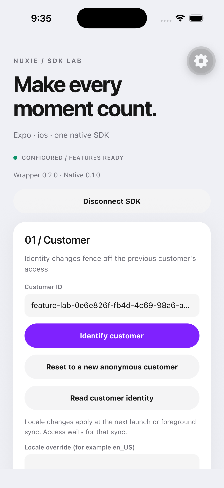

# Nuxie for React Native

**Native Experiences. Live Feature access. One API for React Native and Expo.**

Add Nuxie to your app, trigger the moments you author in the dashboard, and let the native iOS and Android SDKs handle presentation, purchases, and reconciliation. React gets a small typed client and hooks that stay in sync with the current customer.

This branch contains the breaking **0.2** SDK. It replaces the previous API completely. The package has not been published to npm yet; use the [source and packed-package instructions](docs/development.md) to try this checkout. The installation commands below target the 0.2 release.

```tsx
const { access, state } = useFeature('premium_library');

if (state === 'unknown') return <Loading />;
if (access?.allowed) return <Library />;

return <Button title="Explore Premium" onPress={showPremium} />;

async function showPremium() {
  await nuxie.trigger('premium_library_requested');
}
```

`Loading`, `Library`, and `Button` are your app's components. Handle rejected operations in your app's error UI.

## Works where you build

| Host | Integration |
| --- | --- |
| Bare React Native | Autolinking. No Expo dependency. |
| Expo development build | The same package and API. No plugin entry required. |
| Expo production / EAS build | Standard native build; EAS is optional. |
| Expo Go | Custom native code requires a development build. |
| Web / server rendering | Importing is safe; native operations require iOS or Android. |

The initial host matrix is **React Native 0.87.1** and **Expo 57 / React Native 0.86.3**, using the New Architecture and React 19.2.3. Both hosts require iOS 16.4+ and Android 7+; Nuxie's Android runtime supports **arm64-v8a and x86_64**. See [validation](docs/validation.md) for the exact checks completed, and [native pins](NATIVE-PINS.json) for the SDK revisions.

## Install

### Expo

```sh
npx expo install @nuxie/react-native@^0.2.0 expo-dev-client
npx expo run:ios
npx expo run:android
```

Use a development build instead of Expo Go. Nuxie autolinks during prebuild. It needs no Expo runtime dependency of its own, API-key plugin, manual AppDelegate edits, or global `use_frameworks!` setting.

### Bare React Native

```sh
npm install @nuxie/react-native@^0.2.0
cd ios
bundle exec pod install
```

Rebuild the native app. CocoaPods connects the wrapper to the pinned Nuxie Swift Package; the npm package carries the pinned Android native artifact and its dependency metadata.

## Connect once

Create a configuration with your app's **public platform keys**. Keep workspace secrets on your server.

```tsx
import { NuxieProvider } from '@nuxie/react-native';

const configuration = {
  apiKeys: {
    ios: 'YOUR_IOS_PUBLIC_KEY',
    android: 'YOUR_ANDROID_PUBLIC_KEY',
  },
  environment: 'production',
} as const;

export function App() {
  return (
    <NuxieProvider configuration={configuration} onError={reportError}>
      <YourApp />
    </NuxieProvider>
  );
}
```

For Expo Router, wrap your `<Stack />` or `<Slot />` in `app/_layout.tsx`. Setup is asynchronous: the provider renders children immediately, and `useNuxieStatus()` reports `unconfigured`, `configuring`, `configured`, or `failed`.

The defaults are production, warning logging, the device locale, and native purchase handling. Use `environment: 'development'` with development platform keys.

Prefer one stable configuration object. Equivalent concurrent calls share setup; different keys, options, or an external controller require explicit shutdown first. Unmounting a provider removes its observers. It does not shut down Nuxie, reset identity, or interrupt a purchase.

An imperative host uses the same client:

```ts
import { nuxie } from '@nuxie/react-native';

await nuxie.configure(configuration);
```

You can then render `<NuxieProvider client={nuxie}>` without a configuration prop. Hooks use the singleton by default; the provider also accepts a public `NuxieClient` test double.

## React to Feature access

```tsx
import { useFeature, useFeatures, useNuxieStatus } from '@nuxie/react-native';

const premium = useFeature('premium_library');
const snapshot = useFeatures();
const status = useNuxieStatus();
```

A Feature selection contains `state` and `access`. Access contains `allowed`, `unlimited`, `balance`, and `type` (`boolean`, `metered`, or `creditSystem`).

| State | Meaning |
| --- | --- |
| `unknown` | No profile has been admitted for this customer. Show loading or a neutral state. |
| `reconciling` | Native access includes a purchase overlay while authority catches up. |
| `ready` | The current snapshot is authoritative. It may legitimately be empty. |

The hooks observe one immutable native snapshot. They do not fetch, consume usage, or create a separate cache. A change to another Feature does not rerender your unchanged selection.

Use an explicit query when you need fresh authority or entity-specific access:

```ts
const access = await nuxie.hasFeature('exports', {
  policy: 'remote',
  requiredBalance: 1,
  entityId: 'project-123', // omit for unscoped access
});
```

Scoped query results are returned to the caller; they never overwrite an unrelated global hook result. A query that finishes after the customer changes rejects with `staleOperation`.

## Consume with a stable operation ID

```ts
const result = await nuxie.consumeFeature('exports', {
  quantity: 1,
  operationId: exportJob.id,
  entityId: exportJob.projectId,
});

if (result.accepted) {
  await startExport(exportJob);
}
```

`operationId` identifies one business action. **Reuse it when retrying that action.** A new ID means a new spend. Native owns persistence and retries; your app should also make the work it starts idempotent.

Check `accepted` to decide whether consumption committed. A successful final-unit spend may return `accepted: true`, `balance: 0`, and `active: false`. `active` describes access after the command. The result also includes `code`, `quantity`, `operationId`, `unlimited`, and `idempotentReplay`.

Quantities and required balances must be positive safe integers. An uncertain network outcome is not permission to retry under a different operation ID. Entity scope uses grants explicitly assigned to that entity; it does not borrow another entity's credits.

## Identify your customer

```ts
await nuxie.identify(customer.id, {
  properties: { plan: 'pro' },
  propertiesSetOnce: { signupSource: 'mobile' },
});

const customerId = await nuxie.getDistinctId();
const anonymousId = await nuxie.getAnonymousId();
const identified = await nuxie.getIsIdentified();

await nuxie.reset(); // Sign out and rotate the anonymous identity.
await nuxie.setLocaleIdentifier('fr-FR');
await nuxie.setLocaleIdentifier(null); // Follow the device again.
```

Locale changes withdraw the current profile until the next launch or foreground synchronization. Calling `identify` with the same stored customer ID does not force a refresh.

Call `identify` when your app knows the customer and `reset` on sign-out. Do not reset in React effect cleanup. Set `keepAnonymousId: true` only when your identity policy intentionally retains it.

## Trigger an Experience

```ts
await nuxie.trigger('premium_library_requested', { source: 'library' });
await nuxie.dismiss();
```

Author the trigger in Nuxie. `trigger()` acknowledges native invocation; it does not promise that an Experience presented or a Journey completed. Observe native activity and App Actions for what happens next.

```tsx
<NuxieProvider
  configuration={configuration}
  onActivity={activity => analytics.record(activity.name)}
  onAppAction={action => navigationQueue.enqueue(action)}
  onError={reportError}
>
  <YourApp />
</NuxieProvider>
```

Use `useNuxieActivity(handler)` and `useNuxieAppAction(handler)` for component subscriptions, or `nuxie.onActivity(handler)` / `nuxie.onAppAction(handler)` outside React. Each client subscription returns an unsubscribe function. Events are live and are not replayed. Install startup-sensitive handlers on the root provider, and queue navigation until your router is ready.

## Purchases, your way

**Native billing is the default.** StoreKit and Google Play own checkout, verification, finishing, restore, and recovery.

```ts
const result = await nuxie.restorePurchases();
// { type: 'restored' } | { type: 'noPurchases' } | { type: 'failed', message }
```

Already using a purchase provider? Supply one controller at configuration time:

```ts
const configuration = {
  apiKeys,
  billing: {
    mode: 'external',
    controller: {
      purchase: async product => billingAdapter.purchaseExactOffer(product),
      restorePurchases: async () => billingAdapter.restore(),
    },
  },
} satisfies NuxieConfiguration;
```

Your adapter maps its real outcomes to `purchased`, `cancelled`, `pending`, or `failed`. Preserve the exact store product, selected plan/offer, and Apple eligibility context supplied in `StoreProduct`; do not silently substitute an offer. External success does not fabricate verified evidence or grant access.

The separate native observer mode is `billing: { mode: 'native', handling: 'observer' }`. See [purchase controllers](docs/purchase-controller.md) for ownership and result details.

## Explore both example apps



[`examples/bare`](examples/bare) and [`examples/expo`](examples/expo) run the same [SDK Lab](examples/shared/lab.tsx) through different native hosts. The Lab exercises configuration, identity, live Features, scoped checks, consumption and retries, Experience triggers, dismissal, restore, and activity.

The **Run API checks** button talks to your development backend. It verifies live Feature readiness, spends one unit from a chosen entity, retries the same operation ID, proves the second entity is unchanged, and checks reset/reidentify. Results appear in the app. No mock client or hidden success path is used.

| Example | What it demonstrates |
| --- | --- |
| [Bare React Native](examples/bare/README.md) | A standard community CLI app with checked-in native projects and no Expo dependency. |
| [Expo](examples/expo/README.md) | A development build with native projects generated by prebuild and the same SDK API. |

See the [backend setup and checks](docs/development.md#run-the-in-app-backend-checks) and [actual qualification results](docs/validation.md).

See [development](docs/development.md) to build from source, prepare native artifacts, and install the packed SDK into each host.

## Shipping and troubleshooting

A native SDK or bridge change requires a **new native app binary**. Expo OTA updates must stay compatible with that binary and your Expo runtime version. A mismatched bridge fails configuration with `incompatibleBridge`.

| Symptom | Next step |
| --- | --- |
| `nativeUnavailable` | Rebuild the native app; verify autolinking and that you are not using Expo Go. |
| `notConfigured` | Await configuration or observe `useNuxieStatus()`. |
| `alreadyConfigured` | Keep setup stable; await explicit `shutdown()` before replacing it. |
| `staleOperation` | The session or customer changed. Re-evaluate for the current customer; retain the original consumption ID if retrying. |
| Feature state stays `unknown` | Check the platform key, environment, connectivity, and published app configuration. |
| Trigger resolves without presentation | Check the authored event and Journey conditions; inspect live activity. |
| Build cannot find native artifacts | Install a prepared 0.2 tarball, or run `pnpm --ignore-workspace run prepare:native` in a source checkout. |

`shutdown()` is explicit process-level teardown for tests or intentional reconfiguration. It is not normal component cleanup.

[API reference](docs/api-reference.md) · [Architecture](docs/architecture.md) · [Validation](docs/validation.md) · [Development](docs/development.md)
